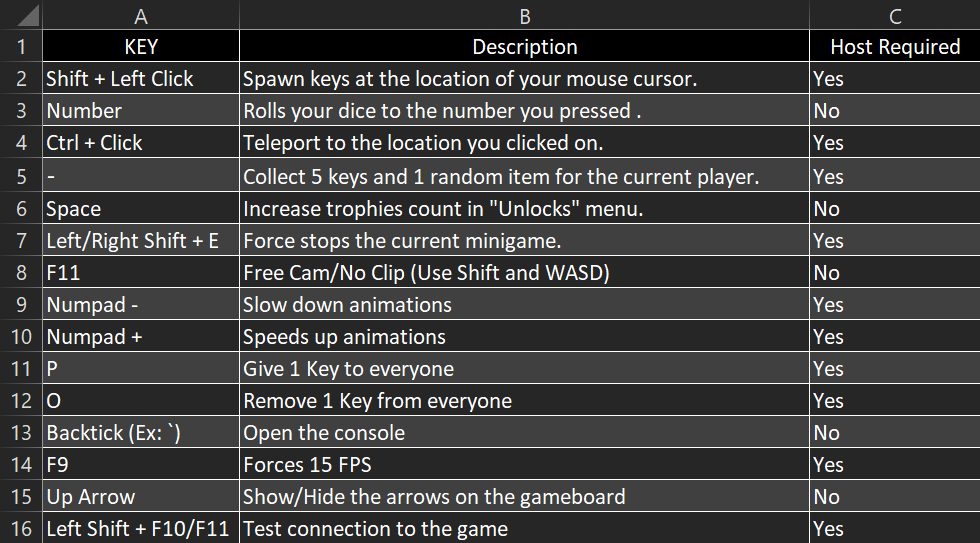

    

<h1 align="center">SchummelPartie</h1>

Power up your Pummel Party experience with this customizable cheat, built for friendly competition or solo practice.

    
      
    
     
    
      
    
    
     
    
     

## Disclaimer

This project is not affiliated with or endorsed by Pummel Party, Rebuilt Games, or any of their affiliates. The use of 
this software is at your own risk. The developers of this project are not responsible for any damages or losses caused 
by the use of this software. This project is intended for educational purposes only.

## Modules

Debug

Toggle the Debug mode.

Force Present

Forces the present to be the one you want.

Animal Arithmetic

Show the answer to the animal arithmetic.

Mystery Maze

Shows the path to the exit.

Mortar Mayhem

Show the answer to the mortar mayhem.

Batty Batter

Automatically hit the ball.

Spooky Spikes

Automatically crouch or jump when needed.

Rockin Rythm

Automatically hit the notes.

Pack And Pile

Automatically place boxes.

Treasure Hunt

Shows the path to the treasure.

Swift Shooters

Automatically shoot the good targets.

Bomber

Bombs are infinite.

Finder

Show the position of the other players.

Barn Brawl

God Mode, Infinite Shotgun (Press F), Burst Shotgun, ESP.

Presents

Automatically collect the best presents.

Selfish Stride

Show the target bridge.

Memory Menu

Show the target food.

Tanks

Rapid Fire.

Sidestep Slope

God Mode.

Speedy Spotlights

Show the position of the other players.

Daring Dogfight

God Mode, Kill All, Burst Shot, ESP.

Elemental Mages

Instantly pick up crystals and disable camera shake.

Crown Capture

No Punch Interval, No Stun, Always Crown

Explosive Exchange

No Punch Interval, No Stun, Always Crown

AirJump

Allows you to jump in the air.

Speed

Allows you to change your speed.

Graphical User Interface

Toggle the GUI with Insert or RightShift.

## Getting Started

### Prerequisites

- [Pummel Party](https://store.steampowered.com/app/880940/Pummel_Party/) (Steam version)
- [MelonLoader](https://melonwiki.xyz/#/README) (latest version)
- [UrGUI](https://github.com/Lyzev/UrGUI/tree/main?tab=readme-ov-file#getting-started) (latest version)

### Installation

1. Download the latest release of SchummelPartie from the [releases page](https://github.com/Lyzev/SchummelPartie/releases).
2. Put the downloaded `SchummelPartie.dll` file into the `Mods` folder of your Pummel Party installation.
3. Run the game and enjoy the mod!

### Contributing

Thank you for considering contributing to this Pummel Party hacked client! Your contributions will help to make it even better.

#### How to set up the development environment

1. Clone the repository.
2. Open the solution in your preferred IDE (e.g.: Rider, Visual Studio).
3. Done!

**NOTE:**  
*The project is built with .NET 4.8. You will need to have it installed to build the project.  
Don't forget to install the prerequisites mentioned in the "Prerequisites" section.*

## Bugs and Suggestions

### Discord

For assistance with minor concerns, feel free to join our supportive community on
the [Discord server](https://lyzev.github.io/discord). Our friendly members and staff are ready to help you.

### GitHub

To ensure a prompt and effective resolution of bugs or to share your suggestions, please submit them through
the [issue tracker](https://github.com/Lyzev/SchummelPartie/issues) of this repository. Kindly utilize the provided templates
and make sure to include all relevant details that would help us understand your issue better. Your cooperation is
greatly appreciated.
